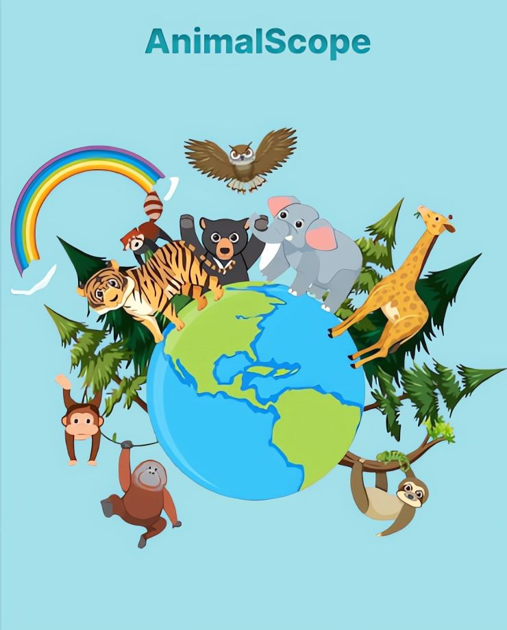

  

<h1 align="center">ANIMAL SCOPE</h1>

Nowadays, extinction and scarcity of animals often occur. The lack of human awareness to maintain and protect nature is one of the causes. Humans unknowingly often destroy nature and the habitat of various animals by littering, cutting down trees in the forest, and many others. In this era of technological development, we must be able to take advantage of technological advances to help us overcome this case. Our team is working to develop an animal recognition application that can help us understand more about animals and increase human awareness about the importance of maintaining and protecting nature. In addition, this application can be a very useful tool in education, especially for children. By getting to know animals, children can learn about different species of animals, their way of life, their living environment and create human awareness to maintain and protect nature.

# TEAM PROFILE
TEAM ID : C23 - PS386  
TEAM MEMBER : 
* M151DSY1741 - Novtry Rezki Simamora (Machine Learning)
* M151DSY2327 - Yessica Maretha Simanjuntak (Machine Learning)
* C058DSY2890 - Marisa Alfia Suciati (Cloud Computing)
* C058DSY2891 - Ayu Istikomah (Cloud Computing)
* A037DSY3416 - Dhiah Ayu Prameswari (Mobile Development)
* A037DSY3418 - Anglin Betseba Lumbantoruan (Mobile Development)

TEAM ROLE ;
* Build Machine Learning model and train model (M151DSY1741 - Novtry Rezki Simamora, M151DSY2327 - Yessica Maretha Simanjuntak) 
* Create database and Deploy API (C058DSY2890 - Marisa Alfia Suciati, C058DSY2891 - Ayu Istikomah)
* Android app development (A037DSY3416 - Dhiah Ayu Prameswari,  A037DSY3418 - Anglin Betseba Lumbantoruan)

# CAPSTONE PROJECT LINKS
Dataset: 
https://drive.google.com/drive/folders/1yY3oPQJG7JYN4r24czmg2RKdkilAaVZR?usp=sharing   
User Interface: 
https://www.figma.com/file/kbJK4FlW46TxwuQ9tGQdDa/AnimalScope?type=design&node-id=0-1&t=WqXwkCheN5ymyYhx-0
